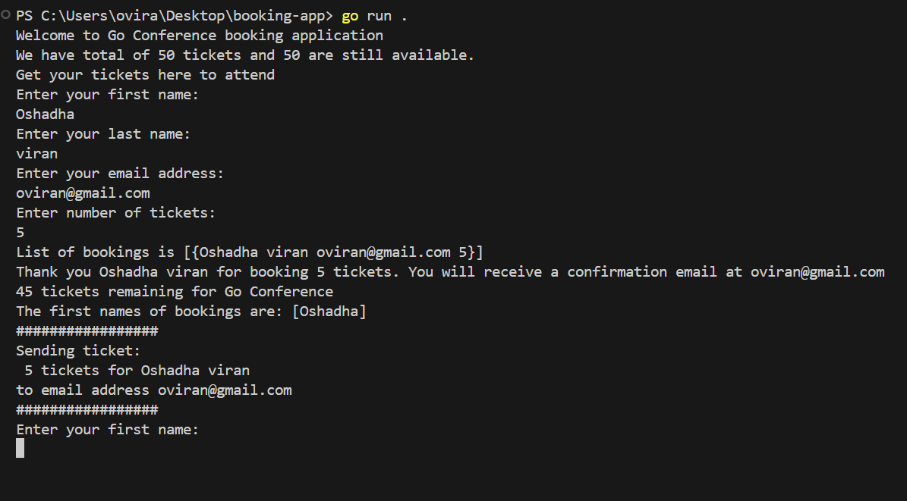

# 🎟️ Ticket Booking App

This repository contains the source code for a Ticket Booking App built using GO language. 
This is very simple CLI application to learn the basics of Go. 

### Learning curve

- Data Types in Go
- Arrays & Slices
- Loops in Go
- Conditionals (if / else) and Boolean Data Type
- Encapsulate Logic with Functions
- Scope Rules in Go
- Maps/Struct
- Goroutines - Concurrency in Go


## 👷 Frameworks, Libraries and TechnologiesTechnologies Used

- GO

## 🚀 Quick start

### Clone the repository

```
https://github.com/oviran/Booking-App.git
```

### Run the project

```
go run .
````

## 🔧 Implementation features

### Output

This is final CLI view



## ✍️ Authors

- [OshadhaViran](https://github.com/oviran)

## 📞 Contact

Oshadha Viran - [@linkedin](https://www.linkedin.com/in/oshadha-viran-847b751a3/) - oviran@gmail.com


